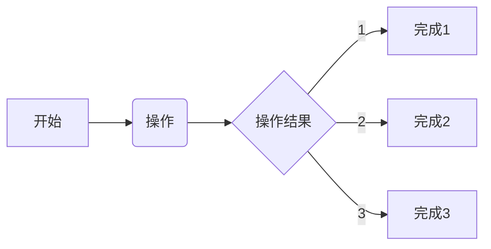

## 设计分割模块
### 2022/12/13 21:56:49
    1. 设计一个简易的灰度分割模块
        * 现在PA上实现
        * 再移植到PL端
    2. 
        * 
    3. 
        * 

```mermaid
graph LR
A[开始] -->B(操作)
B --> C{操作结果}
C -->|1| D[完成1]
C -->|2| E[完成2]
C -->|3| F[完成3]
```