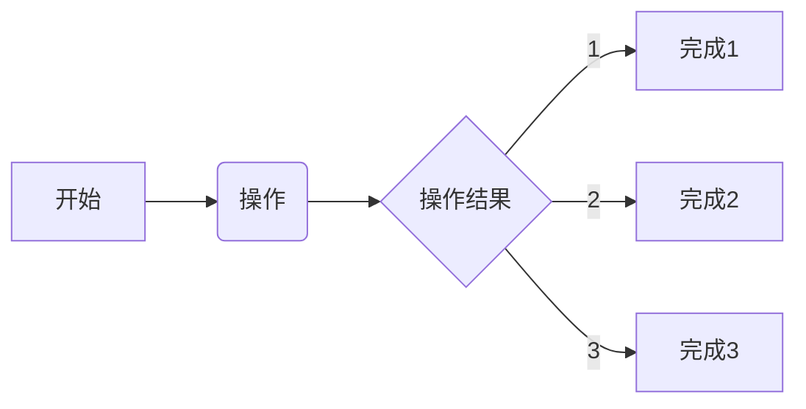

## 构建一个图像切割模块
### 2022/12/13 21:18:49
    1. 在PA中验证最简易的方法
        * 输入RGB信息
        * 输出切割坐标
        * 以fifo作为交互接口
    2. 
        * 
    3. 
        * 

```mermaid
graph LR
A[开始] -->B(操作)
B --> C{操作结果}
C -->|1| D[完成1]
C -->|2| E[完成2]
C -->|3| F[完成3]
```