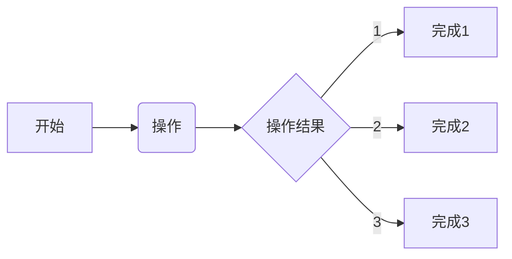

## 基于PA设计整个测试系统
### 2023/01/06 23:48:23
    1. 搭建界面
        * 在QT的框架下添加图像的加载界面
        * 在QT的框架下添加图像的显示界面
    2. 完成数据结构存储
        * ARM端主要熟悉各种数据结构
        * 基于数据结构快速实现各种复杂的模型
    3. 驱动最终的逻辑
        * 目前的数据逻辑训练缺乏大型的数据源
        * 基于图像数据转存是必须实现的一种形式
        * 为了解决这个问题，才搭建目前的平台
