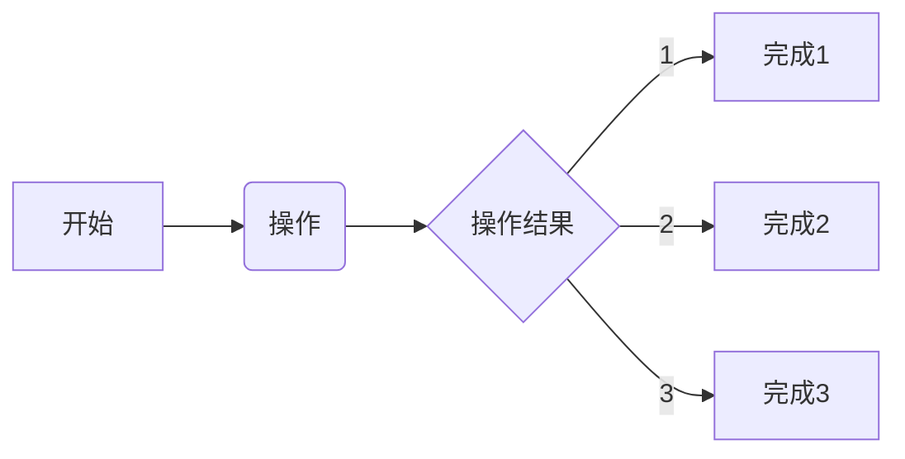

## 图像识别的步骤
### 2022/12/18 12:30:42
    1. 图像切割后可以实现更加复杂的功能
        * 
    2. 利用图像切割的特点，进行多段识别
        * 
    3. 识别完成后，完成对应的解析模组
        * 解析模组一旦完成，数据识别的效果就可以达到预期的要求
        * 目前的设计最主要的问题就是缺少强有力的理论指引
        * 但是，没有条件，创造条件也要上
        * 理想，就是无条件的
