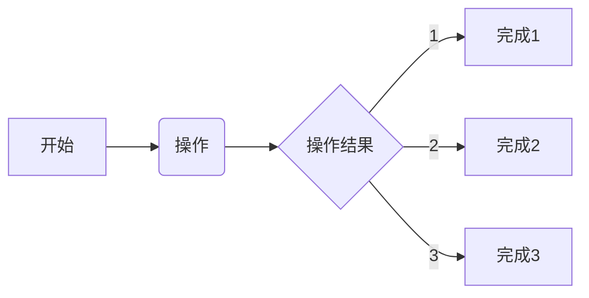

## 实现图像的简单切割
### 2022/12/17 19:59:34
    1. 基本在算法层实现
        * 
    2. 后续基于这个开始构建起始端
        * 目前的框架实际上已经实现
        * 只需要进行仓库的管理，就可以实现快速地响应
    3. 可以将QT延伸到OCTAVE
        * 主要是防止一份代码实现两次
        * 后续基于嵌入式进行算法移植
        * 迅速实现包括数据采集和解析的全套视觉系统
        * 目标调整为视觉系统
        * 视觉系统的建立，将大幅增强整个设计的应用及性能提升
    4. 实现最简单的数字识别
        * 学习体系
        * 控制体系
        * 为了后续的发展，学习体系是必不可少的
        * 也就是数据库体系
        * 学习体系的第一步就是构建框架
            * 无论是何种框架，都必须有实现的方法
    5. 基于FPGA的实现
        * FPGA最大的优势就是并行识别
        * 可以同时访问所有的识别逻辑
        * 这个可以确保所有的识别单元都可以并行实现
        * 这样为复杂环境打下了基础
    6. 以目前的资源量来实现预期的目标
        * 第一步，以EMMC实现的大容量资源的访问有限，但是可以用于实现训练模型的缓存，启动后加载到DDR
        * 第二步，以DDR为数据加载和切割的主要区域，实现大容量数据的加载
        * 第三步，以BRAM为加速单元，实现具体的识别过程，即完成数据和所有可能特征的匹配
    7. 以上面的方法，需要实现以上的能力
        * 算法研发能力
        * PS数据存储及控制能力
        * PL特征匹配能力
    8. 训练的目标
        * 完成大规模复杂系统的研发
        * 基于这个系统，训练出FPGA在整个智能时代的核心

## 实现算法层的图像处理
### 2022/12/31 17:56:02
    1. 按照硬件逻辑，在软件上先实现
        * 目前来看，基于for循环的扫描是最迫切的基础
        * 而PL端的扫描流水可以对应这个需求
        * 目前的算法基本满足FPGA的硬件设计需求
        * 
    2. 完成整个算法基础验算的基础后
        * 可以将算法和仿真结合，实现硬件系统的快速搭建
        * 这是本年度最大的突破
        * 一旦脚本和整个资源匹配
        * 设计的流程将全面脚本化
        * 基于脚本化学习
        * 将为大规模设计打下坚实的基础
    3. 结合工作中的能力
        * 目前的设计进度开始加快
        * 核心的电学能力开始坚实
        * 所以实现高性能设计可以在学习中进行实践
