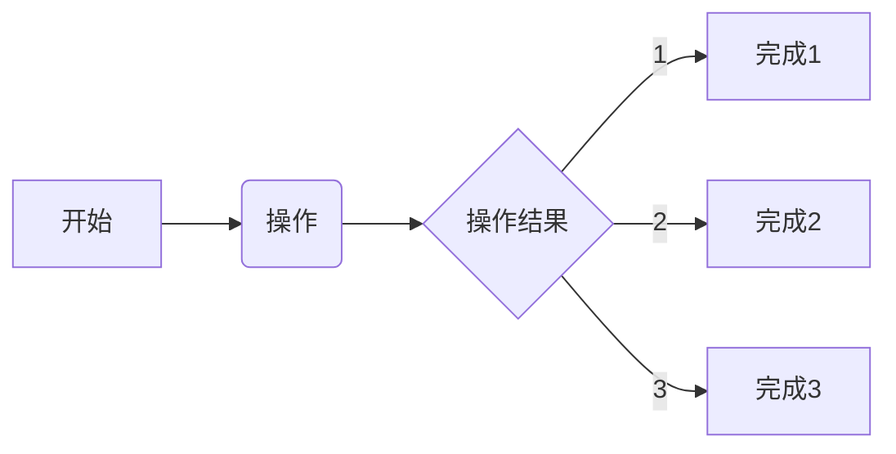
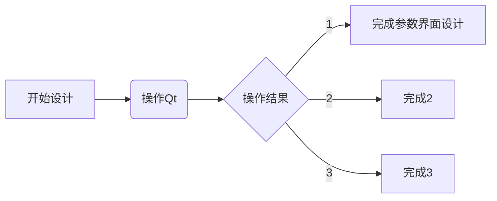

## PC图像识别设计
### 2022/11/16 22:55:40
    1. 设计界面
        * 基于之前的模型快速完成界面的设计
    2. 设计参数
        * 添加常用的参数设置
        * 开始建设参数页
    3. 设计信息
        * 
    4. 设计功能
        * 

## 添加图片加载功能
### 2022/12/09 23:31:59
    1. 上位机添加图片的显示和加载功能
        * 
    2. 指定设计的协议内容
        * 
    3. 需要实现数据流程测试
        * 

## 添加图片切割处理模块
### 2023/01/08 21:10:51
    1. 构建加载模块，实现测试模型
        * 
    2. 完善串口通信模块
        * 
    3. 
        * 

## 完善串口模块
### 2023/01/09 21:13:43
    1. 添加串口界面
        * 
    2. 实现串功能
        * 
    3. 整机测试串口信息打印
        * 

## 实现图片分割算法
### 2023/01/16 22:21:35
    1. 
        * 
    2. 
        * 
    3. 
        * 
